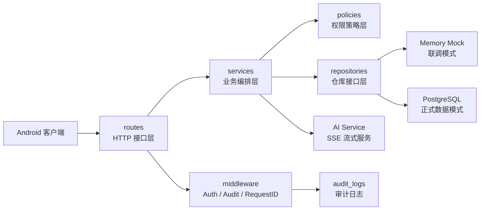
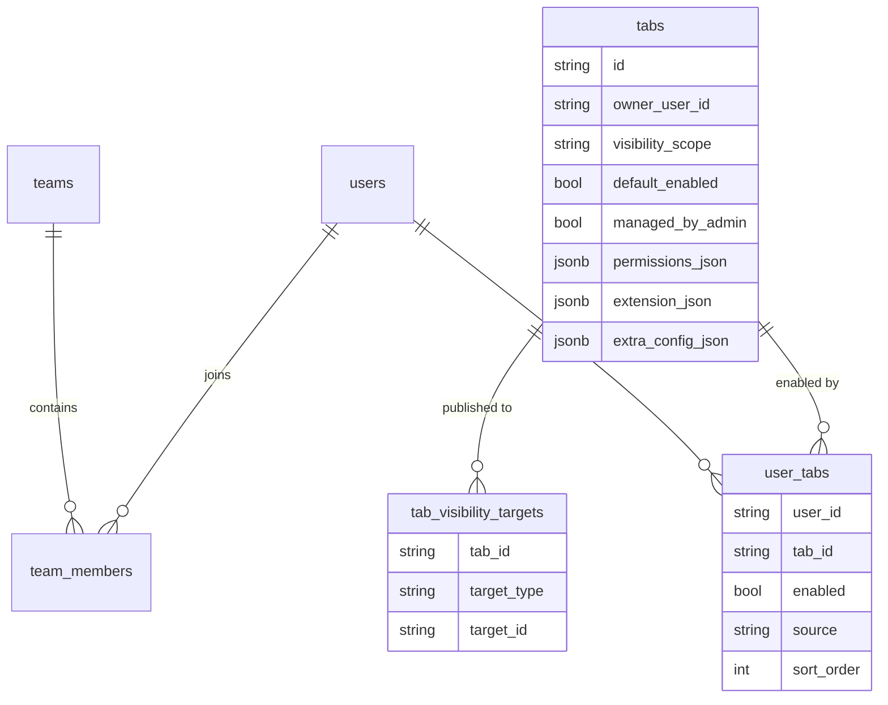
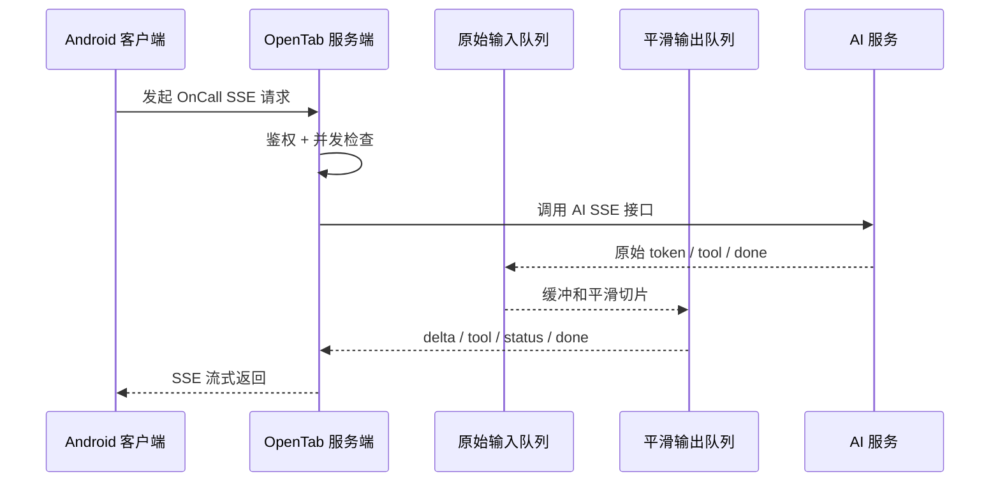
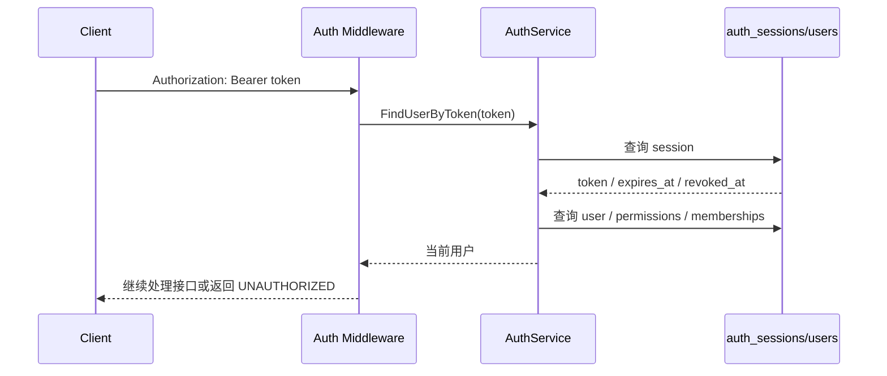
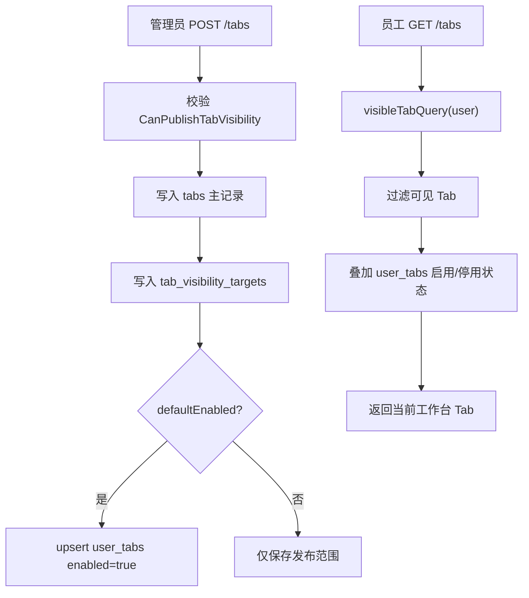
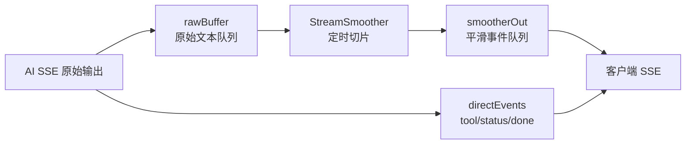

# OpenTab 服务端答辩亮点讲解稿

本文档用于服务端答辩准备，目标是把项目讲成一个有设计思考的后端系统，而不是简单罗列接口。内容包含：核心亮点总结、每个亮点的实现思路、5 分钟演讲稿、可能追问与回答、关键原理说明和三轮自检。

## 一、核心亮点总览

我认为目前服务端真正能称为亮点的内容有 6 个：

1. **分层架构清晰，可从 Mock 平滑切换到 PostgreSQL**
   - 服务端不是把数据写死在路由里，而是拆成 `routes -> services -> repositories -> database/models`，并用 Repository 接口隔离内存数据和 PostgreSQL 数据。

2. **开放式 Tab 的资源级权限控制**
   - Tab 不是简单按 `tabId` 返回，而是根据当前用户、团队、发布范围、权限码共同判断，防止用户知道 `tabId` 后越权启用或查看。

3. **管理员发布 Tab 的可见范围模型**
   - 支持 `self/company/custom` 三类发布范围，`custom` 可以指定部门或用户，并通过 `user_tabs` 的 `enabled=false` tombstone 记录用户主动停用行为。

4. **查询层数据隔离**
   - PostgreSQL 查询阶段直接带上当前用户身份和团队关系，只查当前用户可见的数据，避免“先查全部再在接口层过滤”的泄漏风险。

5. **AI OnCall 流式响应稳定性设计**
   - 服务端不是简单转发 AI 输出，而是做了并发保护、用户级限流、取消生成、重复生成去重、心跳、双缓冲平滑输出和 AI 服务失败降级。

6. **可观测性和测试保障**
   - 服务端有 `request_id`、审计日志、健康检查、debug status，并且测试按模块拆分，覆盖鉴权、Tab 权限、AI 流式、业务数据隔离、策略层。

## 二、系统架构图



这张图答辩时可以讲：

> 我的服务端没有把接口、业务规则和数据库操作混在一起。路由层负责接收请求，服务层负责编排业务，策略层统一处理权限判断，仓库层隔离不同数据源。这样前期可以用 Mock 支撑客户端联调，后期切 PostgreSQL 时客户端接口不需要改。

## 三、亮点一：分层架构与双 Repository 模式

### 我做了什么

服务端把代码拆成几层：

- `routes`：处理 HTTP 请求和响应。
- `services`：处理业务流程，比如登录、创建 Tab、AI 会话、审批操作。
- `repositories`：定义数据访问接口，并分别实现 memory 和 PostgreSQL。
- `database/models`：定义数据库表结构。
- `policies`：集中处理权限和可见性判断。
- `middleware`：处理鉴权、审计、请求 ID。

其中最关键的是 `RepositorySet`：

```text
RepositorySet
  Users
  Tabs
  Business
  OnCall
  Debug
  Audit
```

每一类仓库都有 memory 实现和 PostgreSQL 实现。启动时通过 `APP_MODE` 和 `DATABASE_URL` 决定使用哪一种。

### 为什么这样设计

项目早期客户端还没完全对接，如果一开始就强依赖数据库，会影响联调进度。所以我先用 Memory Mock 数据跑通接口，再把同样的接口迁移到 PostgreSQL。

这种设计的价值是：

- 客户端接口稳定，不用因为数据库接入反复改请求格式。
- 本地测试可以用 memory，速度快。
- 云服务器演示可以用 PostgreSQL，数据可持久化。
- 后续如果增加新的数据源，也只需要实现仓库接口。

### 答辩怎么讲

> 我没有把 Mock 当成临时写死的数据，而是把它做成了和 PostgreSQL 并列的数据源实现。这样服务端可以在 Mock 模式和 PostgreSQL 模式之间切换，路由和 service 层不需要知道底层数据来自哪里。这一点支撑了我们前期快速联调和后期真实部署。

## 四、亮点二：开放式 Tab 的资源级权限控制

### 原来简单做法的问题

如果只判断用户有没有登录，那么只要用户拿到 token，就可能直接调用：

```text
POST /me/tabs
{
  "tabId": "custom-admin-tab"
}
```

如果服务端不判断这个 Tab 是否对当前用户可见，就会出现越权启用的问题。

### 现在的做法

服务端把 Tab 访问拆成三层：

1. **身份认证**
   - Bearer Token 是否有效。
   - Token 是否过期或被 logout 吊销。

2. **资源可见性**
   - 当前用户是否是创建者。
   - Tab 是否是系统 Tab。
   - Tab 是否发布到全公司。
   - Tab 是否发布到当前用户或用户所在团队。

3. **权限码校验**
   - 当前用户是否具备 Tab 要求的权限码，例如 `tab.approval.read`、`tab.admin.manage`。

核心判断集中在 `internal/policies/tab_policy.go`：

```text
CanPublishTabVisibility
CanViewTab
CanUseTab
UserTeamIDs
```

### 为什么这是亮点

开放式 Tab 容器的核心风险是：Tab 是动态创建、动态发布的，客户端隐藏按钮不等于后端安全。服务端必须对“当前用户能否访问这个具体 Tab”做裁决。

这个设计的好处：

- 防止用户猜 `tabId` 越权启用。
- 普通用户只能创建个人 Tab，管理员才能发布到公司或团队。
- 权限规则集中在策略层，后续扩展团队账号、角色权限时更容易维护。

### 答辩怎么讲

> 我把权限控制从“接口级”提升到了“资源级”。不是说用户登录后就能访问所有 Tab，而是每次访问某个具体 Tab 时，服务端都会根据发布范围、团队关系、创建者和权限码做判断。这样即使客户端没有隐藏某个入口，服务端也能兜住安全边界。

## 五、亮点三：管理员发布 Tab 的可见范围模型

### 数据模型



### 三种发布范围

```text
self
  只对创建者可见

company
  全公司用户可见

custom
  指定团队或指定用户可见
```

`custom` 范围不直接塞进 `tabs` 表，而是用 `tab_visibility_targets` 表保存目标：

```text
tabId = custom-product-docs
targetType = team
targetId = team-product
```

### defaultEnabled 和 tombstone

管理员发布 Tab 时，可能希望目标用户默认显示这个 Tab。这里使用：

```text
default_enabled = true
```

但用户也应该能停用某个默认发布的 Tab。问题是，如果只是删除 `user_tabs` 关系，下次刷新时系统可能又因为 `default_enabled=true` 把它显示出来。

所以我用了 tombstone 思路：

```text
user_tabs.enabled = false
source = user_disabled
```

意思是“这个用户主动停用过这个 Tab”。后续 `GET /tabs` 看到这个记录，就不会再自动把默认发布 Tab 加回来。

### 答辩怎么讲

> 管理员发布 Tab 时，我没有简单地把 Tab 加到所有人的列表里，而是区分了“可见范围”和“用户工作台启用状态”。可见范围决定这个用户有没有资格看到，user_tabs 决定这个用户当前是否启用。这样可以支持默认发布，也可以尊重用户主动停用。

## 六、亮点四：查询层数据隔离

### 普通做法

```text
1. 查询所有 tabs
2. 在 service 里循环判断
3. 过滤掉不可见数据
```

这种做法的问题是：如果某个接口忘了过滤，数据就可能泄漏。

### 当前做法

PostgreSQL 仓库层提供 `visibleTabQuery(user)`，查询数据库时就带上当前用户身份：

```text
可见条件包括：
1. 系统 Tab
2. owner_user_id = 当前用户
3. visibility_scope = company
4. tab_visibility_targets 命中当前 user_id
5. tab_visibility_targets 命中当前用户所在 team_id
```

也就是说，仓库层返回给 service 的数据已经是当前用户可见的数据。

### 为什么这样实现

服务端是多用户系统，审批、日程、Tab、AI 会话都涉及不同用户的数据。如果只在前端隐藏或只在 service 层过滤，不够稳妥。

查询层隔离的好处：

- 数据库查询结果天然带访问边界。
- 减少接口漏判造成的数据泄漏。
- 对 `GET /tabs`、`GET /tabs/catalog`、`POST /me/tabs` 都能复用同一套可见性规则。

### 答辩怎么讲

> 我把数据隔离前移到了查询层。比如查询 Tab 时，不是把所有 Tab 查出来再判断，而是 SQL 查询本身就带上当前用户、团队和发布目标。这样每个接口拿到的数据本身就是安全范围内的数据，降低了越权风险。

## 七、亮点五：AI OnCall 流式响应稳定性

### 整体流式链路



### 我做了哪些保护

1. **全局 AI 并发限制**
   - 防止短时间太多 AI 请求压垮服务。

2. **单用户并发限制**
   - 默认一个用户同一时间只允许一个活跃 AI 生成任务。

3. **同一会话重复生成自动取消旧任务**
   - 用户重复触发同一个会话的生成时，服务端会取消旧任务，避免两条回答同时写入。

4. **取消生成**
   - 客户端调用 cancel 后，服务端取消当前上下文，停止继续接收和转发 AI 输出。

5. **重复流式不重复保存**
   - 如果用户退出再进入同一会话，已经生成过 assistant 回复时，不会再次保存一条重复回答。

6. **心跳和等待状态**
   - SSE 长连接没有内容时，服务端会发 heartbeat 或 waiting 状态，避免客户端误以为连接断了。

7. **双缓冲平滑输出**
   - AI 原始输出先进原始队列，再由 smoother 按固定节奏输出小段文本。
   - 好处是 AI 突然吐出一大段内容时，客户端显示更稳定；AI 短暂停顿时，服务端也能给出等待状态。

8. **AI 服务失败降级**
   - AI 服务不可用或还没输出业务内容时，服务端可以返回兼容格式的 Mock 事件，保证客户端体验不至于直接中断。

### 答辩怎么讲

> AI OnCall 这部分我没有只做简单接口转发。因为流式接口在真实使用时会遇到慢响应、重复点击、连接中断、AI 服务异常等问题，所以我在服务端增加了全局限流、用户限流、取消生成、心跳、双缓冲平滑输出和失败降级。这样客户端看到的是稳定的流式体验，而不是完全依赖 AI 服务的输出节奏。

## 八、亮点六：审计、诊断和测试覆盖

### 审计和诊断

服务端中间件做了两件事：

1. **RequestID**
   - 每个请求都有 `X-Request-Id`。
   - 出问题时可以用 request id 追踪一次请求。

2. **Audit**
   - 对登录、Tab、审批、日程、公告、OnCall、管理员接口记录操作日志。
   - 记录用户、接口、状态码、结果、耗时、错误码等。

同时提供：

```text
GET /health
GET /debug/status
GET /debug/permissions
GET /debug/sample-tabs
```

### 测试结构

测试不是全部堆在一个文件里，而是按模块拆分：

```text
auth_routes_test.go
tab_routes_test.go
oncall_routes_test.go
business_routes_test.go
admin_routes_test.go
status_routes_test.go
tab_policy_test.go
stream_smoother_test.go
auth_service_test.go
business_service_test.go
```

覆盖内容包括：

- 登录、注册、登出、Token 吊销。
- 普通用户不能发布 company Tab。
- 管理员发布 team Tab 后目标团队可见，其他团队不可见。
- 非目标用户即使知道 tabId 也不能启用。
- 默认发布 Tab 被用户停用后不会反复出现。
- AI 流式输出、重复生成不重复保存、取消生成。
- 业务数据按团队隔离。
- 策略层单独测试 self/company/custom 可见性。

### 答辩怎么讲

> 我把可观测性和测试作为服务端稳定性的补充。审计日志能回答“谁在什么时候做了什么操作”，测试则证明权限边界不是口头设计，而是可以自动验证的。

## 九、5 分钟演讲稿

下面是一版可以直接照着讲的 5 分钟稿。

各位老师好，我负责的是 OpenTab 项目的服务端部分。这个服务端主要承担账号登录、Token 校验、Tab 注册和发布、业务数据接口、AI OnCall 会话和消息保存，以及后端数据隔离这些能力。

我在设计服务端时，重点没有放在简单堆接口上，而是围绕两个问题来做：第一，开放式 Tab 容器里的动态 Tab，应该由谁决定能不能看、能不能启用；第二，AI OnCall 的流式响应，在真实联调时怎样保证稳定。

首先是整体架构。服务端采用 Go + Gin，内部按 routes、services、repositories、policies、database 分层。routes 只处理 HTTP 请求，services 编排业务流程，repositories 负责数据读写，policies 专门处理权限判断。Repository 层同时有 Memory 和 PostgreSQL 两套实现，前期我用 Memory 支撑客户端快速联调，后期切到 PostgreSQL 后，客户端接口格式不需要变化。这一点保证了团队并行开发时接口稳定。

第二个重点是开放式 Tab 的权限控制。Tab 是可以动态创建和发布的，如果只在客户端隐藏入口是不安全的，因为用户可能知道某个 tabId 后直接调用接口。所以我在服务端做了资源级访问控制。每次访问某个 Tab，服务端都会判断当前用户是不是创建者、Tab 是否发布到全公司、是否发布到用户所在团队或指定用户，以及用户是否具备对应权限码。这个判断集中在 policies 策略层，避免规则散落在各个接口里。

第三个重点是管理员发布 Tab 的模型。我把“Tab 是否对用户可见”和“用户工作台是否启用这个 Tab”拆开处理。tabs 表保存 Tab 主信息和 visibility scope，tab_visibility_targets 表保存发布目标，user_tabs 表保存用户自己的启用状态。这样管理员可以发布给全公司、某个部门或指定员工，同时用户也可以停用默认发布的 Tab。用户停用后，我用 enabled=false 作为 tombstone，避免刷新后又被默认发布逻辑重新加回来。

第四个重点是查询层数据隔离。服务端不是把所有 Tab 查出来后再过滤，而是在 PostgreSQL 查询阶段就带上当前用户和团队关系，只查当前用户可见的数据。这样 GET /tabs、GET /tabs/catalog 和 POST /me/tabs 都复用同一套可见性边界。这个设计的意义是，即使客户端传入一个不属于自己的 tabId，服务端也会在查询层和策略层拒绝。

第五个重点是 AI OnCall 的流式响应。AI 流式接口在真实使用中会遇到输出慢、突然输出一大段、重复点击、取消生成、AI 服务异常等问题。所以我在服务端做了全局并发限制、单用户并发限制、同一会话重复生成自动取消旧任务、心跳、等待状态、双缓冲平滑输出和失败降级。AI 原始输出先进一个队列，再由 smoother 按固定节奏输出给客户端。这样客户端看到的文字输出更平滑，也不容易因为长时间无数据误判连接断开。

最后是可观测性和测试。服务端每个请求都有 request id，并且对登录、Tab、审批、日程、公告、OnCall、管理员操作记录审计日志。测试也按模块拆开，覆盖了登录注册、Token 吊销、Tab 权限、管理员发布范围、AI 流式、业务数据隔离等场景。比如测试里会验证：管理员发布给产品部门的 Tab，产品员工能看到，运营员工看不到，并且运营员工直接拿 tabId 调用启用接口会返回 Forbidden。

总结一下，我这个服务端的核心思路是：客户端负责展示，服务端负责安全边界和状态一致性。开放式 Tab 的可见性、权限判断、数据隔离和 AI 流式稳定性都由后端兜底，这样系统在联调和演示阶段都更可靠。

## 十、可能被追问的问题与回答

### 1. 为什么要做 Repository 层，直接在 service 里写数据库不行吗？

可以写，但会把业务流程和数据来源绑死。我的项目一开始需要支持客户端联调，所以先用 Memory Mock，后面再切 PostgreSQL。如果没有 Repository 接口，切数据库时就会改很多 route 和 service。现在只需要替换仓库实现，接口层和业务层基本不动。

### 2. 你的 Mock 模式是不是只是临时数据，为什么也算设计？

我这里的 Mock 不是写死在路由里的假数据，而是和 PostgreSQL 一样实现同一套 Repository 接口。它的作用是降低早期联调成本，同时保证后期切数据库时接口不变。所以它不只是临时数据，而是双数据源架构的一部分。

### 3. 什么是资源级权限控制？

接口级权限只判断“用户能不能访问这个接口”。资源级权限会进一步判断“用户能不能访问这条具体数据”。比如同样调用 `POST /me/tabs`，用户能启用公开 Tab，但不能启用管理员发布给别的团队的 Tab。

### 4. 为什么不能只靠客户端隐藏 Tab？

客户端隐藏只能改善界面，不能保证安全。用户仍然可能通过接口工具或抓包直接请求某个 tabId。服务端必须自己判断当前用户是否有权访问资源。

### 5. `tab_visibility_targets` 为什么单独建表？

因为 custom 发布范围可能对应多个团队和多个用户。如果把这些目标全部塞进 tabs 表，会导致查询和维护都不清晰。单独建表后，一个 Tab 可以对应多个发布目标，并且可以用联合索引支持查询。

### 6. `user_tabs` 和 `tab_visibility_targets` 有什么区别？

`tab_visibility_targets` 表示“谁有资格看到这个 Tab”。  
`user_tabs` 表示“这个用户自己的工作台当前是否启用了这个 Tab”。  
前者是发布范围，后者是用户状态。

### 7. tombstone 是什么意思？

这里的 tombstone 指用户主动停用默认发布 Tab 后，不删除关系，而是保存 `enabled=false`。它表示“这个用户明确不想显示这个 Tab”。后续即使 Tab 仍然是默认发布，也不会再次自动显示。

### 8. 查询层数据隔离有什么优势？

它可以减少漏判风险。如果所有数据先查出来再过滤，某个接口忘记过滤就可能泄漏。查询层直接带用户条件，返回的数据天然在用户可见范围内。

### 9. AI 双缓冲平滑输出具体做了什么？

AI 服务的原始输出先进入 rawBuffer，服务端再通过 StreamSmoother 按固定间隔和固定字数切成 delta 输出。这样 AI 一次吐出一大段时，客户端不会突然刷一大块；AI 短时间没输出时，服务端还能发等待状态。

### 10. 心跳包有什么用？

SSE 是长连接，如果一段时间没有业务数据，客户端或中间网络可能以为连接断了。服务端定时发送 heartbeat，告诉客户端连接仍然活着。

### 11. 取消生成是怎么实现的？

服务端为每个活跃流保存 cancel 函数。客户端调用取消接口后，服务端取消对应 context，后续就会停止读取 AI 输出并停止向客户端推送。

### 12. 如果 AI 服务挂了怎么办？

服务端会先尝试调用 AI 服务。如果 AI 服务不可用或还没有输出有效业务事件，服务端会降级返回兼容格式的 Mock 事件，保证客户端不会直接崩掉。

### 13. 为什么一个用户默认只允许一个 AI 生成任务？

主要是防止重复点击导致多个流同时写入同一个会话，造成重复回答或顺序混乱。对于演示和当前业务场景，单用户一个活跃生成任务更稳定。

### 14. 登录态是怎么做的？

登录成功后服务端生成随机 token，存入 `auth_sessions`，带过期时间。之后客户端用 Bearer Token 调接口。logout 时服务端设置 `revoked_at`，后续这个 token 会返回 TOKEN_REVOKED。

### 15. 密码是否加密？

注册和登录升级时使用 bcrypt 存储密码哈希，不直接存明文。旧的明文演示账号在登录成功后也会升级为 bcrypt hash。

### 16. 你的测试如何证明权限设计有效？

有策略层测试，也有路由级测试。比如管理员发布给产品团队，产品员工可以看到，运营员工看不到，并且运营员工直接调用启用接口也会被拒绝。这证明了前端隐藏之外，后端确实有权限边界。

### 17. 目前还有哪些不足？

目前还没有做完整的团队生命周期、复杂角色模型、生产级迁移版本管理和 HTTPS 证书自动化。当前重点是阶段项目里的接口联调、权限隔离、AI 流式稳定性和可演示的数据持久化。

## 十一、具体原理补充

### Token 鉴权链路



关键点：

- token 是随机值，不是固定永久 token。
- session 表保存 token、过期时间、吊销时间。
- 中间件只把合法用户放入请求上下文。
- 后续 service 使用当前用户判断资源权限。

### Tab 发布和查询链路



关键点：

- 管理员发布不靠客户端循环调用 `/me/tabs`。
- 服务端统一解析目标用户集合。
- 用户主动停用后用 `enabled=false` 保留状态。

### AI 流式双缓冲原理



关键点：

- 文本类 delta 进入平滑队列。
- tool、status、done 等结构化事件直接传递。
- smoother 定时输出固定大小的文本片段。
- 长时间无输出时发送 waiting 状态。

## 十二、三轮自检

### 第一轮：亮点是否真实存在

已检查代码：

- 架构分层：`routes/services/repositories/policies/database` 确实存在。
- 双 Repository：`NewMemoryRepositorySet` 和 `NewPostgresRepositorySet` 确实存在。
- Tab 策略层：`tab_policy.go` 确实集中处理发布、可见性和权限码。
- 查询层隔离：`visibleTabQuery(user)` 确实在查询阶段带用户和团队条件。
- AI 稳定性：`AIConcurrencyLimiter`、`UserAIStreamLimiter`、`StreamSmoother`、cancel active stream 确实存在。
- 审计：`Audit` middleware 和 `audit_logs` 表确实存在。

结论：这些亮点不是包装出来的，代码里确实实现了。

### 第二轮：图是否合理

已检查五张图：

- 系统架构图体现了客户端、路由、中间件、服务、策略、仓库、数据库、AI 的关系。
- Tab ER 图体现了 `tabs/user_tabs/tab_visibility_targets/users/teams` 的核心关系。
- AI 整体流式链路图体现了客户端、服务端和 AI 服务之间的 SSE 调用关系。
- Token 鉴权链路图体现了 Bearer Token、session、用户权限和中间件之间的关系。
- AI 双缓冲图体现了原始队列、平滑队列和客户端 SSE 的链路。

结论：图的粒度适合答辩，不会细到代码级，也不会宽泛到看不出实现。

### 第三轮：讲解效果是否足够

已检查 5 分钟稿：

- 前 1 分钟讲职责和架构。
- 中间 2 分钟讲 Tab 权限、发布模型、查询隔离。
- 后 1 分钟讲 AI 流式稳定性。
- 最后 1 分钟讲审计和测试。

结论：整体重点明确，能体现“服务端不是简单接口集合，而是在开放式 Tab 和 AI 流式场景下做了安全边界、数据隔离和稳定性设计”。
